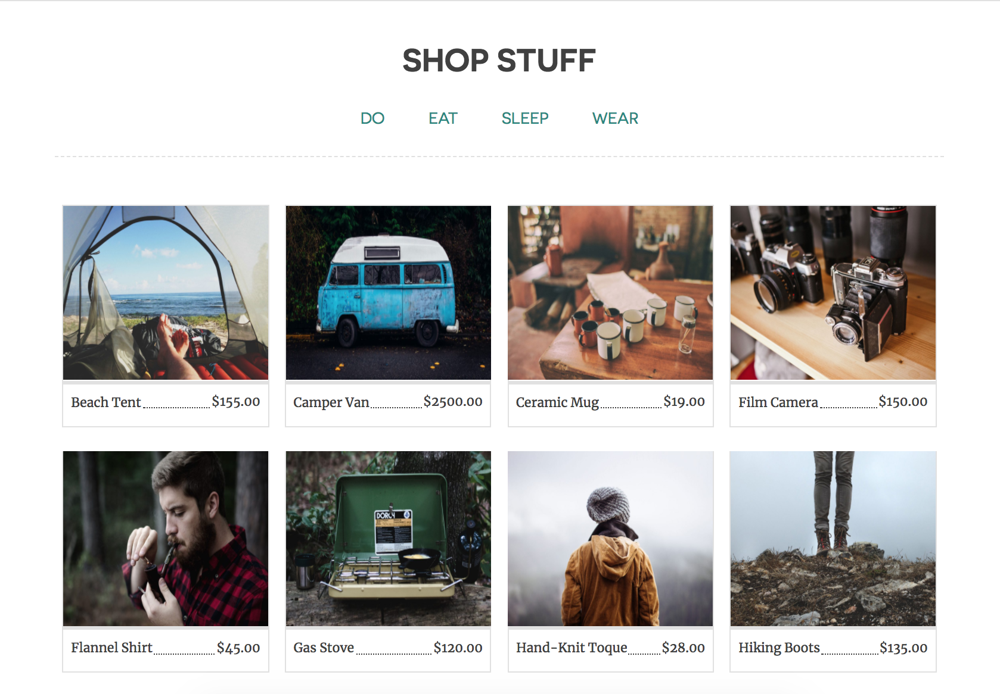

  

 # Inhabitent Camping Supply Co. Website
  
 Utilizing WordPress, PHP, SCSS, and HTML, I have created a custom WordPress theme for the Inhabitent Camping Supply Co. website. 
 
 The site contains blog posts, product descriptions, a custom homepage, an about page, and a find us page.

 

## Dependencies

Run `npm install` **inside theme directory** to install the node modules for Gulp, etc.
 

 ## Take aways
  
 This opportunity was integral in the further development of my project planning and SCSS architecture. During the process and consequent revelations, I found it essential to take steps back--reaccess progress and ensuing issues--to move forward once again.
  

 ## Built With
  
 [VScode](http://www.vscode.com) - Text Editor

 ### ...and

* PHP
* Wordpress
* Html 5
* CSS
* SCSS
* JavaScript
* jQuery
* Gulp
* Eslint
 
 ## Author
 
 Audra Kornicki - [Audrobot](https://github.com/Audrobot)
 
 ## License
 
 This project is unlicensed
 
 ## Acknowledgments
 
 Many thanks to Jim Bennett, Rose Cass, & RED Academy for all the guidance and support.
